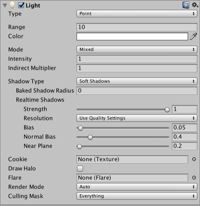
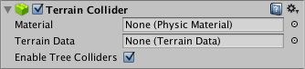
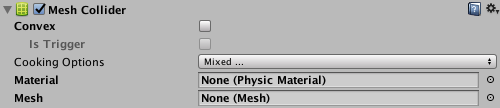

- # Game Object
    
    - name
    - Static
    - Layer
    - Transform
        1. Position
        2. Rotation
        3. Scale
    - Component
        - Camera  
            
            1. Clear Flags
                - Skybox
                - Solid Color
                - Depth only
                - Don't Clear
            2. Background
            3. Projection
                - perspective
                  - Field of View
                - Orthographic
                  - size
            4. Clipping Planes
                - Near
                - Far
            5. Viewport Rect
                - X
                - Y
                - W
                - H
            6. Allow HDR
        - Light  
            
            1. Type
                - Directional
                - Spot
                  - Range
                  - Spot Angle
                - Point
                  - Range
            2. Color
            3. Mode
                - Realtime
                - Mixed
                - Baked
            4. intensity
        - Mesh Filter  
            
            1. Mesh
        - Mesh Renderer  
            
            1. Materials
                - Size
                - Element
            2. Cast Shadows
                - On
                - Off
            3. Receive Shadows
            4. Lightmap Static
                - Lightmaps
                  - Baked Lightmap
                    - Lightmap Index
                    - Tiling X
                    - Tiling Y
                    - Offset X
                    - Offset Y
        - Skinned Mesh Renderer  
            
            1. Mesh
            2. Root Bone
            3. Bounds
                - Center
                - Extent
            4. Cast Shadows
                - On
                - Off
            5. Receive Shadows
            6. Materials
                - Size
                - Element
        - Animator   
            
            1. Controller
            2. Culling Mode
                - Always Animate
                - Cull Completely
        - Terrain / Terrain Collider  
            
            1. Terrain Data
        - Box Collider  
            
            1. Is Trigger
            2. Center
            3. Size
        - Sphere Collider  
            
            1. Is Trigger
            2. Center
            3. Radius
        - Capsule Collider  
            
            1. Is Trigger
            2. Center
            3. Radius
            4. Height
            5. Direction
        - Mesh Collider  
            
            1. Is Trigger
            2. Mesh
        - Rigidbody  
            
            1. Mass
            2. Is Kinematic
            3. Use Gravity
            4. Constraints
                - Freeze Position
                - Freeze Rotation
        - Trail Renderer  
            
            1. Materials
                - Size
                - Element
            2. Time
            3. min Vertex Distance
            4. Width
            5. Color
                - Gradient
                    1. mode
                        - Blend
                        - Fixed
                    2. Color
                    3. Alpha
                    4. Location
            6. Alignment 
                - View
                - TransformZ
            7. Texture Mode
                - Stretch
        - Fixed Joint
            
            1. Connected Body
            2. Break Force
            3. Break Torque 
        - Configurable Joint
            
            1. Connected Body
            2. Anchor
            3. Axis
            4. Connected Anchor
            5. Secondary Axis
            6. X Motion
            7. Y Motion
            8. Z Motion
            9. Angular X Motion
            10. Angular Y Motion
            11. Angular Z Motion
            12. Linear Limit Spring
                - Spring
                - Damper
            13. Linear Limit
                - Limit
                - Bounciness
            14. Angular X Limit Spring
                - Spring
                - Damper
            15. Low Angular X Limit
                - Limit
                - Bounciness
            16. Hight Angular X Limit
                - Limit
                - Bounciness
            17. Angular YZ Limit Spring
                - Spring
                - Damper
            18. Angular Y Limit
                - Limit
                - Bounciness
            19. Angular Z Limit
                - limit
                - Bounciness
            20. Target Position
            21. Target Velocity
            22. Break Force
            23. Break Torque